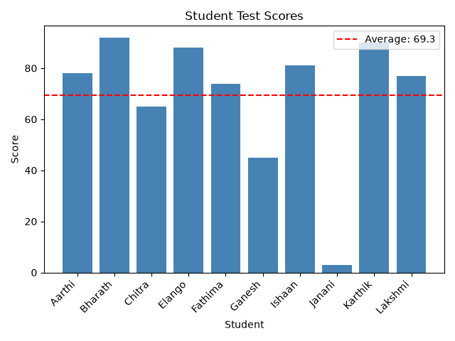

# Q2 — Data Processing and Visualization

> Given a dataset containing information about students' test scores, fetch the data
> from an API, calculate the average score, and create a bar chart to visualize the data.

## What I built

| File | Purpose |
|---|---|
| [`mock_api.py`](mock_api.py) | A FastAPI stand-in for "the API" — test fixture, not the assessed part. |
| [`scores_chart.py`](scores_chart.py) | The actual answer: fetch → validate → average → bar chart. |
| `scores_chart.png` | Output of running `scores_chart.py` against the fixture below. |

## Why a mock API

No live "student test scores" REST API exists publicly and none was specified, so I
stood one up with FastAPI instead of hand-waving the fetch step. The client
(`fetch_scores` in `scores_chart.py`) only assumes a GET endpoint returning
`[{"student": str, "score": number}]` — point `API_URL` at any endpoint with that
shape and the rest of the pipeline is unchanged.

FastAPI over something like `json-server`: it's a framework I can defend the choice of
and had already built a service with, rather than reaching for the first mock tool that
comes up in a search.

## The fixture — deliberately messy

A clean fixture means clean code and nothing to say about it. I seeded four realistic
problems on purpose, so the client actually has to handle them instead of just calling
`sum()` and moving on:

| student | score | seeded issue |
|---|---|---|
| Deepak | `None` | score never recorded |
| Fathima | `"74"` | number sent as a string |
| Harini | `105` | outside the valid 0–100 range |
| Janani | `3` | valid, but a genuine outlier |

## The pipeline

- **`fetch_scores`** — GET with `timeout=10` and `raise_for_status()`. Same reasoning as
  `fetch_books` in Q1: no timeout means a stalled server hangs the process forever; no
  status check means a 404/500 body gets parsed as if it were real data.
- **`validate_scores`** — returns `(clean, rejected)`, never just the clean list. A score
  is valid only if it's present, numeric (coercing numeric strings via `float()`), and
  within 0–100. Everything dropped is reported with a reason, not silently discarded.
- **`calculate_average`** — mean of the **valid** scores only. What counts as valid is
  decided entirely inside `validate_scores`, so this function stays trivial.
- **`plot_scores`** — bar chart with the average drawn as a dashed `axhline`, legend,
  axis labels, rotated x-tick labels (`rotation=45, ha="right"`) so names don't overlap,
  and `fig.tight_layout()` so they don't get clipped. `fig.savefig()` is called **before**
  `plt.show()` — calling it after leaves you with a blank PNG, since `show()` clears the
  figure once the window closes.

## The four decisions, measured

Each of these changes the final average, so each was computed both ways rather than
picked by instinct.

| decision | option A | option B | difference |
|---|---|---|---|
| Deepak (missing score) | excluded → **69.30** (n=10) | counted as 0 → **63.00** (n=11) | 6.30 |
| Harini (105, out of range) | excluded → **69.30** (n=10) | included as-is → **72.55** (n=11) | 3.25 |
| mean vs median | mean **69.30** | median **77.50** | 8.20 |

**Deepak: excluded, not zero.** Same principle as `NULL` in Q1 — a missing score means
*unrecorded*, not *the student scored zero*. Treating it as 0 punishes Deepak for a data
problem, not a test result, and drags the class average down by 6.3 points for a student
who never actually took the test as far as this dataset is concerned.

**Harini: dropped, not clamped.** A score of 105 on a 0–100 scale is a plausible data-entry
error, not a real score. Clamping it to 100 would fabricate a value that was never
recorded — 1 point different from dropping in this case, but conceptually it's inventing
data. Dropping it and reporting *why* keeps the data-quality problem visible instead of
quietly overwriting it.

**Fathima's `"74"` was coerced, not rejected.** A numeric string is an obvious
formatting slip (e.g. an upstream system that serializes numbers as text), not evidence
the value itself is wrong. It's counted as a normal 74 in the average.

**Mean (69.30) vs median (77.50).** The 8.2-point gap is driven by two low scores
(Janani's 3, Ganesh's 45) that pull the mean down more than they can pull the median,
since the median only cares about rank, not magnitude. For "how did the class do
overall," median is the more honest single number here — mean is the right one if you
actually care about total/aggregate performance (e.g. summed scholarship funding).

## What validation actually dropped

Running against the live fixture:

```
Fetched 12 records, 10 valid, 2 rejected
  dropped 'Deepak' (score=None): missing
  dropped 'Harini' (score=105.0): out of 0-100 range

average: 69.30
median:  77.50
```

## Chart



10 bars (Deepak and Harini excluded), dashed red line at the average (69.3), legend,
rotated names.

## Things that went wrong while building this, and how

- **`plt.show()` hangs in a non-interactive shell.** Running the script through an
  automated tool has no real display to pop a window on, so the default matplotlib
  backend blocks waiting for a window that's never actually shown. Worked around it for
  my own test runs only, by forcing `MPLBACKEND=Agg` as an environment variable — the
  script itself is unchanged, and running it normally (`python scores_chart.py` in a
  regular terminal) opens a real interactive window as expected, since `Agg` is only
  what I used for headless verification.
- **The background mock server outlived the shell that started it.** `uvicorn` detaches
  once launched, so after the wrapper shell "completed," the server was still actually
  running — confirmed with a follow-up `curl` rather than assuming either way. Had to
  find it by the port it was listening on and stop it by PID once testing was done,
  since there was no other handle left to it.

## Known limitations

- `validate_scores` accepts any numeric string (`"74"`, `"74.5"`, `" 74 "`), which is
  more permissive than the spec technically requires — a genuinely corrupt string like
  `"seventy-four"` is correctly rejected, but so is anything that isn't parseable, with
  no distinction made between "minor formatting" and "garbage."
- Scores are validated per-record in isolation; there's no cross-record check (e.g.
  flagging a student who appears twice with different scores).
- `API_URL` is hardcoded to `localhost:8000` — no CLI argument or config for pointing
  at a different host.
- No automated tests; verified by hand against the live mock, the same way as Q1.

## How to run

```bash
pip install fastapi uvicorn requests matplotlib

# terminal 1
uvicorn mock_api:app --port 8000

# terminal 2
python scores_chart.py
```
